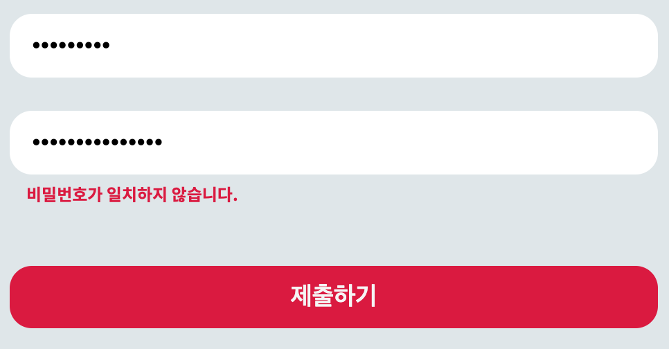

## value만 적는 방법

```jsx
<Input {...register("email", { required: true })} />
```

- 객체를 열어서 필요한 validation을 작성할 수 있다. required의 경우, key를 required로, values는 `true` 혹은 `false`로 작성하면 된다.
- 물론 HTML에도 required가 있기는 하지만, 위처럼 javascript를 이용해서 작성하면 더욱 더 안전하게 form을 보호해 줄 수 있다.
- 이 경우에는 문제 위치를 특정할 수는 있으나 사용자에게 에러 메시지를 보내주기는 어렵다.

## message와 value를 모두 적는 방법 (object 보내기)

객체를 열어서 필요한 validation을 작성할 수 있다. required의 경우, key를 required로, values는 `true` 혹은 `false`로 작성하면 된다.

```jsx
<Input
  {...register("password", {
    required: "이메일을 반드시 입력하세요",
    minLength: {
      value: 5,
      message: "너무 짧습니다.",
    },
  })}
  type="text"
  placeholder="Password"
/>
```

- object를 열어서 value와 message를 보내면 에러 기준과 에러 메시지를 같이 보내줄 수 있다.

## 정규 표현식으로 검사하기

```jsx
<Input
  {...register("email", {
    required: true,
    minLength: 10,
    pattern: {
      value: /^[A-Za-z0-9._%+-]+@naver.com$/,
      message: "@naver.com으로 끝나야 합니다.",
    },
  })}
  type="text"
  placeholder="Email"
/>
```

- 정규표현식은 pattern 안에 위와 같이 작성하여 검사할 수 있다.
- `formState.error`를 통해 보았을때 인풋이 비어있으면 required를 먼저 띄우고, 인풋이 있는데 정규표현식을 충족하지 못한다면 "@naver.com으로 끝나야 합니다."라고 메시지를 띄우게 된다.
- 이처럼 중요도와 순서를 react-hook-form이 알아서 판단해서 에러를 적절히 띄워준다.

## 커스텀 유효성 검사 (Custom Validation)

### 어떨 때 사용하는가

- 위에서 살펴본 유효성 검사는 input의 길이, 입력 여부 등 비교적 단순한 값을 측정하여 유효성을 검사한다.
- 커스텀 유효성 검사는 API 혹은 서버 등과 통신하여 사용자가 제출한 username이 이미 다른 사람이 사용 중인지 아닌지를 검사하는 등, 프리셋 이외에도 다양한 상황에 적용할 수 있도록 개발자가 커스텀할 수 있는 유효성 검사이다.

### 비밀번호와 비밀번호 확인란의 일치 여부 확인

#### setError 가져오기

```jsx
const {
  register,
  handleSubmit,
  formState: { errors },
  setError,
} = useForm <
IForm >
{
  defaultValues: {
    email: "@naver.com",
  },
};
```

#### 에러 상황 가정하기

```jsx
const onDataValid = (data: IForm) => {
  if (data.password !== data.passwordConfirm) {
    setError(
      "passwordConfirm",
      {
        message: "비밀번호가 일치하지 않습니다.",
      },
      { shouldFocus: true }
    );
  }
};
```



- setError의 첫 번째 인자는 register 해놓은 인풋 중에 타겟을 설정하면 되고, 두 번째 인자는 에러 내용을 작성한다.
- 세 번째 인자(선택)는 문제가 발생한 곳으로 포커스를 옮겨줄 지 여부를 결정할 수도 있다. (shouldFocus: true)

#### 아이디 중복 검사하기

```typescript
const onFormValid = (data: IForm) => {
	if (data.username.includes("pnescene")) {
		setError(
		"username",
		{ message: "이미 존재하는 아이디입니다." },
		{ shouldFocus: true }
		);
	}}
};
```

- 위와 똑같은 방식으로 접근하면 된다.
- includes()라는걸 처음봐서 그게 좀 생소하긴 했다.

> 요약하자면, handleSubmit의 function 내부에서 if문으로 커스텀 검사 내용을 적고, 이후 setError로 에러 내용을 그때그때 만들어서 던져주면 된다.
