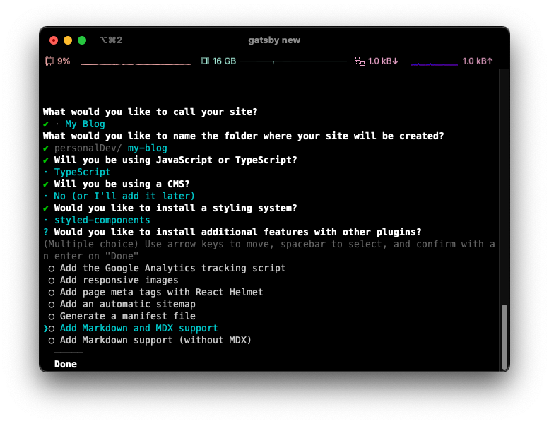

# Gatsby를 선택한 이유 🤔

개츠비는 리액트 기반의 정적 사이트 생성기이다. 구조적인 이유로 속도가 빠르다는 등의 장점도 있지만, 무엇보다 CRA 등을 통해서 이전에 리액트 프론트엔드 개발을 해본 개발자라면 (바로 나🙋‍♂️) 개츠비의 개발 환경에 금방 적응할 수 있고, 리액트가 제공하는 훌륭한 기능들 또한 그대로 이용할 수 있어서 기존처럼 리액트 방식으로 개발할 수 있다는 점이 개츠비를 선택한 가장 큰 이유였다.

뿐만 아니라 개츠비는 정적 사이트 생성에 도움이 되는 꿀같은 기능들을 기본 혹은 플러그인 기능으로 제공하고 있다. react-router-dom 등으로 라우팅을 따로 해줄 필요도 없이 폴더 구조와 파일 이름 기반으로 라우팅을 설정할 수 있다던가 (Next.js처럼), 아니면 이미지에 lazy loading을 적용시킨다던가, 마크다운 파일을 리액트 컴포넌트로 변환시켜준다던가.. 이처럼 귀찮고 어려운 부분들을 정말 많이 도와준다.

리액트 개발 경험과 아주아주 조금의 graphql 지식만 있다면 누구든지 도전해볼만 한 것 같다. 무엇보다 한 번 제대로 만들어서 배포까지 끝내놓은 후에는 마크다운 파일만 꾸준히 업데이트 해주면 블로그가 (대부분) 알아서 유지가 되기 때문에 굉장히 편하고 재밌어보였다..

# 개츠비 개발환경 셋업 💻

## Gatsby CLI 설치

```bash
npm install -g gatsby-cli
```

## 새로운 Gatsby 프로젝트 생성하기

```bash
gatsby new
```



터미널에서 `gatsby new` 커맨드를 입력하면 프로젝트 이름부터 스타일 솔루션까지 프로젝트 생성에 필요한 다양한 옵션을 제공한다. 위아래 버튼으로 움직일 수 있고, 리턴키를 눌러서 선택할 수 있다. 이 글에서는 styled-components와 TypeScript를 선택하고, MDX 플러그인을 추가로 설치하기로 하였다.

> Gatsby CLI에서 추가로 사용할 수 있는 다양한 명령어들에 대해 자세히 살펴보려면 [여기](https://github.com/gatsbyjs/gatsby/blob/master/packages/gatsby-cli/README.md)로

## 개발 시작!

이후부터는 CRA와 대부분이 동일하다! `npm start` 혹은 `gatsby develop` 명령어를 통해 개발 중인 프로젝트의 실시간 미리보기가 가능하고, 라우팅은 폴더명과 파일명을 원하는 url 경로명으로 수정하면 개츠비가 알아서 라우팅까지 해준다. 대부분이 동일하지만 개인적으로 개츠비 개발에 필수적이라고 생각되는 부분들을 몇 가지 짚고 넘어가보겠다.

# 개츠비 방식으로 개발하기 💁‍♂️

## Layout 컴포넌트 만들기

개츠비에서는 react-router-dom 등의 라우터 라이브러리를 사용할 필요가 없기 때문에 Router 컴포넌트도 따로 존재하지 않는다. CRA 개발환경에 익숙한 개발자라면, 보통 헤더나 푸터처럼 모든 화면에서 항상 표시되는 컴포넌트를 그릴 때는 당연히 라우터 컴포넌트에 같이 작성하는 방식이 익숙할거라 생각되기 때문에 개츠비 같은 환경에서는 어떻게 해야 하나 난감할 수 있다.

이런 상황에서 개츠비는 공식 문서를 통해 Layout 컴포넌트를 만들 것을 권장하고 있다. 이건 딱히 개츠비만의 특별한 방식은 아니고, 일반적인 리액트 개발에서도 자주 쓰는 문법이다!

```jsx
// Layout.tsx
function Layout({ children }: LayoutProps) {
  return (
    <>
      <Header />
      <Container>{children}</Container>
      <Footer />
    </>
  );
}
```

```jsx
// Home.tsx
function Home() {
  return (
    <Layout>
      <h1>여기에 본문 내용을 작성합니다</h1>
    </Layout>
  );
}
```

아마 children prop을 써보신 분이라면 단번에 이해했을 것 같다! Layout 컴포넌트에 헤더와 푸터를 그리고, 자식 컴포넌트(children)를 렌더할 위치까지 잡아준다. 그리고 다른 컴포넌트를 작성할 때마다 Layout 컴포넌트로 감싸주면, 매번 children 위치에 컴포넌트들을 렌더할 수 있다.

### Layout 컴포넌트에서 전역 스타일과 테마 설정까지 잡아주기

```jsx
function Layout({ children }: LayoutProps) {
  const [isDark, setIsDark] = useState(
    JSON.parse(localStorage.getItem("isDark") || "false")
  );
  return (
    <ThemeProvider theme={isDark ? darkTheme : lightTheme}>
      <GlobalStyles />
      <Header isDark={isDark} setIsDark={setIsDark} />
      <Container>{children}</Container>
      <Footer />
    </ThemeProvider>
  );
}
```

개인적으로는 위처럼 styled-component의 테마와 전역 스타일 설정 등도 레이아웃에 한 번에 모아두었다.

> 개츠비 공식 문서에서 설명하는 [Layout Components](https://www.gatsbyjs.com/docs/how-to/routing/layout-components/)

## Link API 사용하기

```jsx
import { Link, navigate } from "gatsby";

/* 중략 */

<Link to="/home">Go To Home</Link>
<GoBack onClick={() => navigate(-1)}>Go Back</GoBack>
```

이 부분은 react-router-dom과 또오옥같다고 보면 된다! `Link`와 `navigate`를 통해 원하는 url로 넘길 수 있다.

> 개츠비 공식 문서에서 설명하는 [Link API](https://www.gatsbyjs.com/docs/reference/built-in-components/gatsby-link/)

_다음 편에 계속..._
