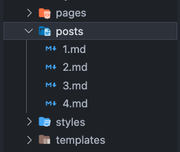
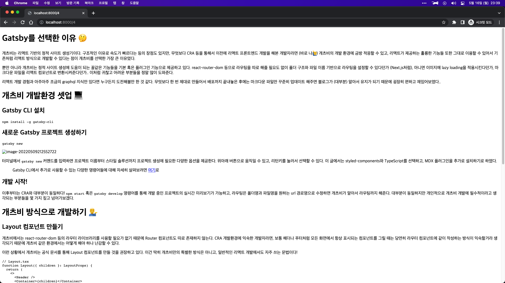

# 개츠비 플러그인이란? 🤨

본격적으로 블로그를 만들기에 앞서, 우리가 이용할 개츠비 플러그인이 무엇인지에 대해 간단히 알아둘 필요가 있다. 개츠비 플러그인은 개츠비에서 제공하는 자체 라이브러리로서, 개츠비로 개발하면서 자주 사용하는 기능들을 쉽고 빠르게 이용할 수 있도록 과정을 단축시켜주는 역할을 해준다.

처음에 `gatsby new` 커맨드를 통해 개츠비 프로젝트를 만들면서 우리는 이미 `gatsby-plugin-mdx`를 설치했었다. 이 플러그인은 우리가 블로그 글로 작성한 마크다운 파일을 마법처럼 리액트 컴포넌트로 변환해주는 역할을 해준다. 플러그인이 잘 설치되어 불러와졌는지 확인하기 위해서는 `gatsby-config.ts` 혹은 `gatsby-config.js`를 열어보면 된다.

```typescript
const config: GatsbyConfig = {
  siteMetadata: {
    title: `my-blog`,
    siteUrl: `https://www.yourdomain.tld`,
  },
  plugins: [
    "gatsby-plugin-styled-components",
    "gatsby-plugin-mdx",
    {
      resolve: "gatsby-source-filesystem",
      options: {
        name: "pages",
        path: "./src/pages/",
      },
    },
  ],
};
```

내 경우에는 `plugins` 배열 안에 이미 `gatsby-plugin-styled-components`, `gatsby-plugin-mdx`, `gatsby-source-filesystem` 이렇게 세 가지가 불러와져 있는 것을 확인할 수 있었다.

> 당연하지만 패키지 설치 (의존성) 여부만 확인하고 싶다면 package.json을 보면 된다.

# MDX 플러그인 셋팅 (gatsby-config.ts) ✒️

## .md 혹은 .mdx 파일을 저장할 폴더 생성하기



내 경우에는 src 폴더 내에 post 라는 이름의 폴더를 만들어서 그 안에 모든 마크다운 파일을 넣기로 했다. 또한, 파일 이름을 그대로 url 경로명으로 쓸 생각이기 때문에 생성한 순서대로 고유한 숫자를 붙여두었다.

## gatsby-config.ts 설정하기

### .mdx와 .md 파일 둘 다 인식되도록 하기

```typescript
/* 전략 */
{
  resolve: "gatsby-plugin-mdx",
  options: {
    extensions: [`.mdx`, `.md`],
  },
}
/* 후략 */
```

플러그인의 상세 옵션을 추가하려면 위와 같은 방식으로 오브젝트를 열어주면 된다. 플러그인 별 상세한 옵션과 사양들은 개츠비 공식 문서를 참고하기 바란다. 여기에서는 `.mdx`와 `.md` 파일을 둘 다 인식시키기 위해서 위와 같은 옵션을 적용시켰다.

### 마크다운 파일명을 pathname으로 만들기

```bash
npm install gatsby-plugin-page-creator
```

```typescript
/* 전략 */
{
  resolve: "gatsby-source-filesystem",
  options: { name: "pages", path: "./src/pages" },
},
{
  resolve: "gatsby-source-filesystem",
  options: { name: "posts", path: "./src/posts" },
},
{
  resolve: "gatsby-plugin-page-creator",
  options: { path: "./src/posts" },
},
/* 후략 */
```

`gatsby-file-system`은 기본적으로 개츠비 설치와 함께 딸려오는 플러그인이다. 개츠비 파일 시스템 플러그인의 역할은 지정한 path 내의 파일들을 GraphQL의 노드로서 표시되게 해주는 역할을 한다. 나중에 조금 더 설명하겠지만, 추후에 마크다운 내에 있는 데이터를 GraphQL로 불러와서 활용하기 위해서는 필수적으로 설정해줘야 한다.

`gatsby-plugin-page-creator`는 파일명과 폴더명 기반으로 pathname으로 만들어서, 해당 pathname으로 접속했을 때 일치하는 동명의 컴포넌트를 표시해주는 플러그인이다. 근데 엥? 그거 pages 폴더 내에서 라우팅 할 때 기본으로 제공하는거 아냐?? 라고 생각할 수도 있는데, 해당 기능은 pages 폴더 내에 있는 파일들에만 개츠비에서 기본으로 제공해주는거고 그 이외의 경로에도 적용하고 싶을때는 `gatsby-plugin-page-creator`를 이용한다고 보면 된다.

> 개츠비 공식 문서에서 설명하는 [Using `gatsby-source-filesystem`](https://www.gatsbyjs.com/docs/how-to/sourcing-data/sourcing-from-the-filesystem/#using-gatsby-source-filesystem)

# 템플릿 페이지 만들기 🗺



여기까지만 했어도 지정한 파일 경로로 접속했을 때 마크다운 파일이 화면에 얼추 표시되는 것을 알 수 있을 것이다. 그러나 뭔가 아주 휑하고 못생겼다.. 보통 블로그들을 보면 포스트 페이지에 걸맞는 양식이 있고, 그 안에 본문이 들어가 있는 경우가 일반적이다. 그러니 우리도 그걸 해보자.

## PostTemplate.tsx 만들기

```typescript
import React from "react";

function PostTemplate() {
  return null;
}

export default PostTemplate;
```

이름은 아무래도 상관없다. 말 그대로 포스트 전용 템플릿이니까 이렇게 지었다.

## gatsby-plugin-mdx의 defaultLayout 설정

```typescript
import path from "path";
/* 중략 */
{
  resolve: "gatsby-plugin-mdx",
  options: {
    defaultLayouts: {
      default: path.resolve("./src/templates/PostTemplate.tsx"),
    },
    extensions: [`.mdx`, `.md`],
  },
}
/* 후략 */
```

다시 `gatsby-config.ts` 파일로 돌아와서 위와 같이 템플릿 설정을 해준다. 사실 `gatsby-plugin-mdx`가 없다면 좀 더 복잡한 설정이 필요한데, 덕분에 우리는 템플릿 설정을 마법처럼 코드 두 세 줄로 해결했다.

## PostTemplate.tsx에서 마크다운 컴포넌트 불러오기

```jsx
import React from "react";
import styled from "styled-components";

interface PostTemplateProps {
  children: JSX.Element;
}

const Container = styled.section``;

function PostTemplate({ children }: PostTemplateProps) {
  return <Container>{children}</Container>;
}

export default PostTemplate;
```

사용법은 이전시간에 다뤘던 Layout 컴포넌트와 비슷하다고 생각하면 된다.

이제 PostTemplate 컴포넌트를 마음껏 꾸며주면 그런대로 봐줄만한 페이지가 나오겠지만 아직도 몇 가지 부족한 점들에 눈치챘을 것이다. 먼저 이미지가 올바르게 표시되지 않는다. 이는 이미지를 위한 별도의 개츠비 플러그인 설정이 필요하기 때문이다. 또, 마크다운 파일에서 설정해 둔 제목이나 날짜 등을 불러올 방법이 아직까지는 없다. 사실 Template로 등록한 컴포넌트에서는 prop으로 children 이외에도 훨씬 더 다양한 데이터를 받아올 수 있는데, 다음 편에는 이러한 것들에 대해 알아보도록 하겠다.

_다음 편에 계속..._
