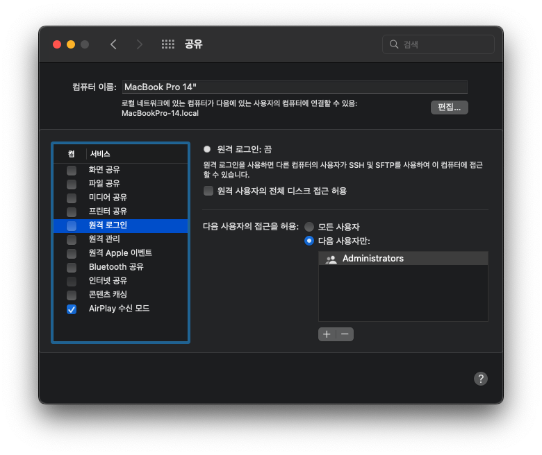

> 본 게시글은 vim 사용법에 대한 내용은 생략되어 있습니다. vim을 통한 문서 수정 방법이 익숙치 않은 분들은 `vim` 명령어 대신 `open` 명령어를 통해 Finder에서 폴더로 접근해 기본 텍스트 편집기로 수정해주시면 됩니다.

## 설정에서 ‘원격 로그인’ 활성화


서버 쪽 맥의 설정 > 공유에서 원격 로그인을 켜주면 해당 맥으로의 ssh 접속을 허용한다는 것을 의미한다.

## 서버 포트 변경해주기

### sshd_config

```bash
sudo vim /private/etc/ssh/sshd_config
```

기본 설정에서는 `#Port 22` 라고 되어 있을건데 해쉬태그는 여기서 주석을 의미한다. 주석을 떼어주고 원하는 포트 번호로 바꿔서 작성해주면 된다.

### services 설정

```bash
sudo vim /etc/services
```

이 문서에서는 모든 포트 설정을 관리하고 있다. `/ssh`로 검색해서 ssh 포트 구성을 기본 22에서 원하는 포트 번호로 변경해준다.

## ssh 재부팅

```bash
sudo launchctl stop com.opensssh.sshd
sudo launchctl start com.openssh.sshd
```

재부팅 후 변경된 포트 설정이 적용되었는지 테스트하여 확인해보면 된다. 참고로 클라이언트 쪽에서 포트 번호를 넣어서 접속할 때는 `ssh 유저명@ip주소 -p포트번호` 형식으로 접속해주면 된다.

## 공유기 포트포워딩

대상 IP와 변경했던 포트번호를 기억했다가 각자의 공유기 설정에 맞게 포트포워딩 해주면 된다.

## RSA Key 발급과 등록

### 클라이언트 사이드

```shell
ls ~/.ssh
```

아무런 설정을 한 적이 없다면 아마 폴더 두 개만 존재한채로 `id_rsa.pub`라는 파일은 생성되어 있지 않을 것이다.

```shell
ssh-keygen
```

만약 `id_rsa.pub` 파일이 없다면 위 명령어로 RSA Key를 생성해주면 된다.

```shell
pbcopy < ~/.ssh/id_rsa.pub
```

이 명령어는 방금 생성한 RSA 키를 클립보드에 복사한다는 뜻이다. 이대로 호스트 서버 설정으로 넘어가면 된다.

### 서버 사이드

```shell
sudo vim ~/.ssh/authorized_keys
```

클라이언트 쪽에서 복사해온 RSA 키를 이 파일에 넣어주면 된다.

```shell
sudo vim /etc/ssh/sshd_config
```

```sshd_config
PasswordAuthentication no
ChallengeResponseAuthentication no
UsePAM no
```

이제 RSA Key를 통해서만 로그인을 허용하기로 했다면 기존처럼 패스워드를 통한 로그인을 막아야 하기 때문에 호스트 쪽에서 몇 가지 추가 설정이 더 필요하다. 다시 한 번 sshd_config를 열어서 위 항목들을 보기처럼 바꿔주면 된다.

> [Mac에서 ssh 접속 설정 - 애플 macOS 홈서버 구축 튜토리얼 | mBlog.kr](https://mblog.kr/bbs_view.html?no=82&page=2&category=0)
> [Disable ssh password authentication on High Sierra - Ask Different](https://apple.stackexchange.com/questions/315881/disable-ssh-password-authentication-on-high-sierra)
> [Change port / Relaunch ssh / Set XAuth in Mac OS Catalina — Kyuseok Oh](https://kyuseokoh.work/archive/2020/10/29/change-port-relaunch-ssh-in-mac-os-catalina)
